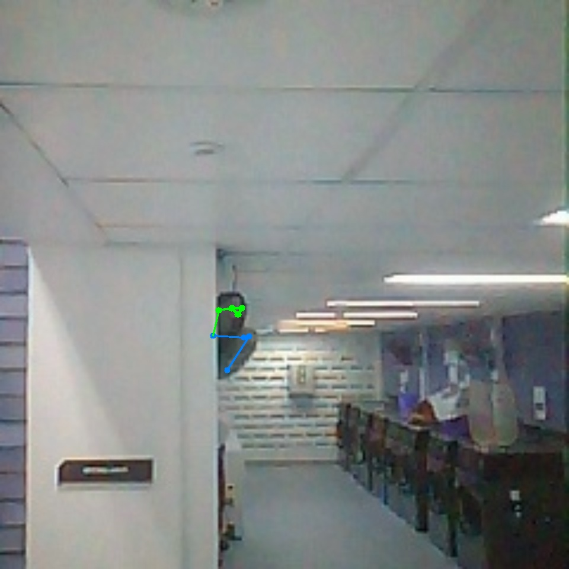
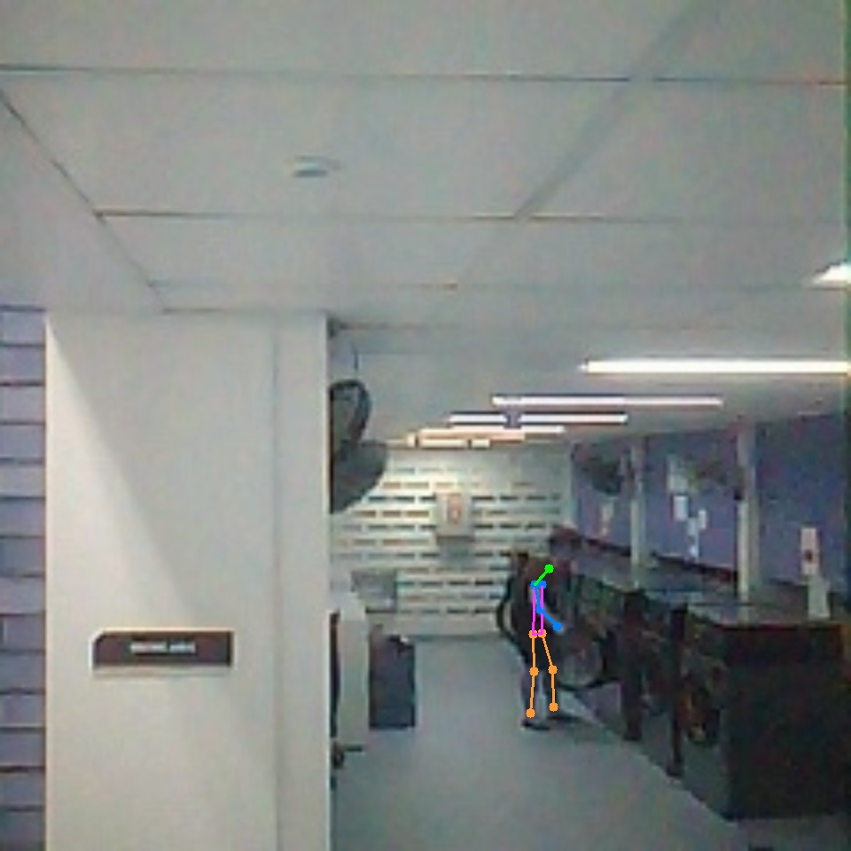

# DLLM: Laundry Machine Status Monitoring

Don't Leave Laundry Dirty (DLLM) is a CS3237 prototype for checking the status of shared laundry machines without walking down to the laundry room first.

The system combines two signals:

- IMU readings from hardware mounted on washers and dryers.
- Camera-based activity detection around the machines.

Those signals move through MQTT/AWS IoT Core, Lambda, DynamoDB, and a small web frontend.

## Repository Layout

| Path | What is in it |
| --- | --- |
| [arduino](./arduino/) | ESP32/Arduino firmware for washer and dryer IMU sensing. |
| [esp32-camera](./esp32-camera/) | ESP-IDF camera/MQTT code for ESP32 camera boards. |
| [task_detection](./task_detection/) | YOLOv7-based pose detection and task classification scripts. |
| [aws](./aws/) | Terraform and Lambda functions for AWS IoT Core, DynamoDB, API Gateway, and Lambda. |
| [tests](./tests/) | Python tests for Lambda handlers and state transitions. |
| [report](./report/) | Photos, diagrams, and experiment outputs used in the project report. |
| [pitch_deck](./pitch_deck/) | Exported pitch deck images. |

## Team

| Component | Main work | Contributor |
| --- | --- | --- |
| Arduino | IMU data collection and edge classifier | Chao Yi-Ju |
| AWS | Cloud services and frontend integration | Nicholas Oh |
| ESP32 | Camera capture and wireless communication | Cheah Hao Yi |
| Task detection | Pose analysis and washer/dryer task classification | James Wong, Cheah Hao Yi |

## System Flow

1. The washer and dryer firmware reads IMU data and publishes machine activity signals.
2. ESP32 camera devices capture frames near the laundry machines and send them for pose processing.
3. The camera pipeline runs YOLOv7 pose detection, filters for bending/loading poses, and classifies whether the person is interacting with a washer or dryer.
4. AWS IoT Core routes vibration and camera events to Lambda.
5. `updateMachineStateFunction` merges both sources into one machine state in DynamoDB.
6. `fetchMachineStatusFunction` returns machine status data to the frontend.

The state machine uses these statuses:

- `available`
- `loading`
- `in-use`
- `finishing`
- `ready-to-unload`

Terraform for the AWS side lives in [aws](./aws/). The configured frontend origin is `https://dllmnus.vercel.app`.

## Hardware Setup

The IMU module is mounted on the side of each laundry machine.


The ESP32-S3-CAM is mounted at an angle facing the machines so it can observe loading and unloading activity.


The camera signal is used as a second source of evidence. IMU data can tell us that a machine is spinning, but it cannot reliably tell whether someone is loading, unloading, or just walking past.

## AWS Architecture


The cloud side uses:

- AWS IoT Core topic rules for vibration and camera messages.
- Lambda functions for ingestion, state updates, status fetching, and test/demo status changes.
- DynamoDB tables for machine status, vibration data, camera detections, and WebSocket connections.
- API Gateway/WebSocket resources for client connections.
- S3 for archiving old data.

The main data path is shown below.


The frontend polls `fetchMachineStatusFunction` for current machine status.


## Detection Notes

### IMU Classifier

Washer readings did not separate cleanly into wash, rinse, and spin phases. The strongest signal was the spin phase near the end of a cycle.


Dryer readings were cleaner: acceleration magnitude was enough to detect whether the dryer was active.


The final embedded model uses acceleration-derived features so that small differences in sensor mounting angle do not break classification. A random forest with `n_estimators=20` and `max_depth=4` was small enough to convert to C++ with `micromlgen` and run on the ESP32.

### Camera Classifier

ESP32 camera frames are compressed before being sent to the backend. Lower JPEG quality produced smaller frames, roughly 4 KB, but YOLOv7 pose detection became inconsistent. The project used higher-quality frames, roughly 20 KB, to keep detection usable.

YOLOv7 was used for person/pose detection:

https://github.com/WongKinYiu/yolov7

False positives were still a problem, especially when no one was actually interacting with a machine.



Correct detections looked like this:



To avoid marking a machine as in use whenever someone walks past, the task model checks body angles at the shoulders, hips, and knees. Poses below about 150 degrees are treated as bending. A decision tree then uses head coordinates from bending poses to classify washer interaction versus dryer interaction.

## Testing Notes

The project was tested against the cases that caused the most trouble during development:

- Peak usage periods: status updates continued without visible delay.
- Weak or interrupted WiFi: local caching reduced data loss, and MQTT resumed sending after reconnect.
- Uneven IMU mounting: calibration and magnitude-based features kept the classifier usable.
- Longer runtime: duty cycles and RTOS scheduling allowed the ESP32 setup to run for more than 100 hours.

Automated tests cover the Lambda handlers and state-machine behavior.

```bash
bun run test
pytest tests/python
```

## References

- [YOLOv7](https://github.com/WongKinYiu/yolov7)
- Professor Boyd Anderson and Professor Wang JingXian, for CS3237 project guidance.
